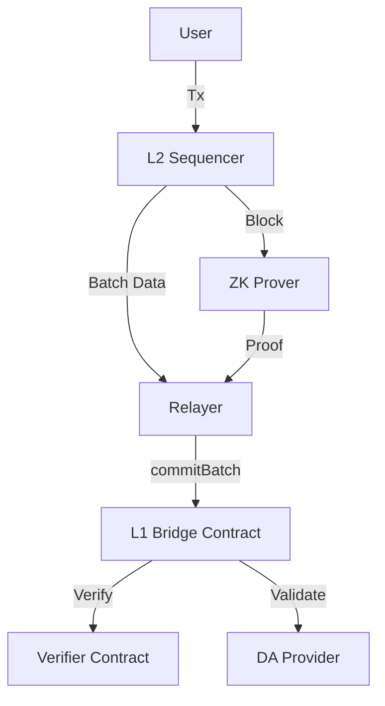

# System Architecture

This document outlines the high-level architecture of the ZK Rollup system and how the L1 contracts interact with off-chain components.

## Overview

The system follows a typical centralized sequencer rollup architecture with decentralized settlement and data availability.

## Components

### 1. L2 Sequencer (Off-chain)
- **Responsibility**: Order transactions, execute state transitions, and produce L2 blocks.
- **Output**: 
  - `Batch Data`: Compressed transaction data.
  - `New Root`: The new Merkle state root.

### 2. ZK Prover (Off-chain)
- **Responsibility**: Generate a Groth16 Zero-Knowledge proof attesting to the validity of the state transition from `Old Root` to `New Root`.
- **Inputs**: 
  - Trace data from the Sequencer.
  - Public Inputs: `DA_Commitment`, `Old_Root`, `New_Root`.

### 3. Relayer (Off-chain)
- **Responsibility**: Aggregate the Proof, Batch Data, and Metadata, and submit them to the L1 Bridge.
- **Key Actions**:
  - Encodes the transaction for `ZKRollupBridge.commitBatch`.
  - For Blob DA: Handles the Blob transaction lifecycle (sidecar attachment).

### 4. L1 Contracts (On-chain)
- **ZKRollupBridge**: The entry point. Validates the sequencer authority, checks DA availability, and triggers proof verification.
- **DA Strategies**: 
  - `CalldataDA`: validates data exists in calldata (implicit).
  - `BlobDA`: validates data exists in EIP-4844 blobs (via `blobhash`).
- **Verifier**: Verifies the Groth16 proof on-chain.

## Data Availability Flows

### Calldata Mode
1. **Sequencer** compresses transaction data.
2. **Relayer** sends `commitBatch` with `batchData` populated in the transaction calldata.
3. **Bridge** calculates `keccak256(batchData)` as the commitment.
4. **Verifier** ensures the proof covers this commitment.

### Blob Mode (EIP-4844)
1. **Sequencer** produces a Blob containing transaction data.
2. **Relayer** sends a Blob-carrying transaction to `commitBatch`. 
   - `batchData` is empty.
   - `daMeta` contains the Versioned Hash and Blob Index.
3. **Bridge** calls `BlobDA`.
4. **BlobDA** checks `blobhash(index) == expectedHash`.
5. **Verifier** ensures the proof covers the `expectedHash`.

## Security Model

- **State Correctness**: Guaranteed by ZK Proofs (Cryptographic).
- **Data Availability**: Guaranteed by Ethereum (L1).
- **Censorship Resistance**: Currently relies on the Sequencer (future work: forced inclusion).
- **Admin Keys**: The `owner` of the bridge can upgrade the verifier and change the sequencer (protected by a 2-step process).
